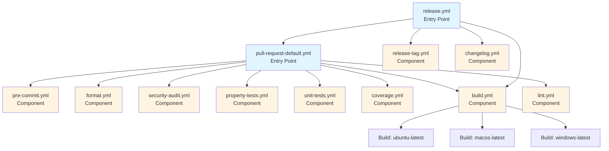

# Design Document: CI/CD Testing Enhancement

## Overview

This design transforms the current sequential CI/CD testing approach into a modular, concurrent system using GitHub Actions reusable workflows. The architecture separates concerns between entry-point workflows (triggered by events) and component workflows (reusable testing units), enabling parallel execution, improved maintainability, and faster feedback cycles.

The design leverages GitHub Actions' `workflow_call` trigger for reusability, matrix strategies for concurrent execution, and cargo-llvm-cov for comprehensive coverage reporting. All workflows will support both automatic event-based triggering and manual `workflow_dispatch` triggering with appropriate inputs.

Key architectural principles:
- **Separation of Concerns**: Entry-point workflows only orchestrate; component workflows execute specific checks
- **Concurrency**: Independent checks run in parallel using matrix strategies and job dependencies
- **Reusability**: Component workflows can be called from multiple entry points
- **Testability**: Each component workflow is independently testable

## Architecture

### Workflow Hierarchy



### Workflow Types

**Entry-Point Workflows** (`.github/workflows/pull-request-default.yml`, `.github/workflows/release.yml`, etc.):
- Triggered by GitHub events (`pull_request`, `push`, `create`) or `workflow_dispatch`
- Named after their triggering event or purpose
- Only contain `uses:` statements to call component workflows
- Define matrix strategies for concurrent component execution
- Pass inputs (ref, branch) to component workflows

**Component Workflows** (`.github/workflows/pre-commit.yml`, etc.):
- Triggered via `workflow_call`
- Implement a single, focused check or action
- Accept inputs for configuration (ref, branch, platform, etc.)
- Return outputs for status reporting
- Can be called from multiple entry points

### Concurrency Model

The system achieves concurrency through three mechanisms:

1. **Independent Job Execution**: Component workflows with no dependencies run simultaneously
2. **Matrix Strategies**: Entry points use matrices to call component workflows with different parameters
3. **Platform Parallelism**: Build and test jobs use OS matrices for cross-platform validation

```yaml
# Example: Entry point calling component with matrix
jobs:
  build-all-platforms:
    strategy:
      matrix:
        os: [ubuntu-latest, macos-latest, windows-latest]
    uses: ./.github/workflows/build-matrix.yml
    with:
      platform: ${{ matrix.os }}
      ref: ${{ github.ref }}
```

## Components and Interfaces

### 1. Entry-Point Workflow: pull-request-default.yml

**Purpose**: Orchestrate all CI checks for pull requests targeting the default branch

**Triggers**:
- `pull_request` targeting main/master
- `workflow_dispatch` with inputs: `ref` (string), `branch` (string)

**Jobs**:
```yaml
jobs:
  # Independent checks (run concurrently)
  pre-commit:
    uses: ./.github/workflows/pre-commit.yml
    with:
      ref: ${{ inputs.ref || github.ref }}
      
  format:
    uses: ./.github/workflows/format.yml
    with:
      ref: ${{ inputs.ref || github.ref }}
      
  security:
    uses: ./.github/workflows/security-audit.yml
    with:
      ref: ${{ inputs.ref || github.ref }}
      
  lint:
    uses: ./.github/workflows/lint.yml
    with:
      ref: ${{ inputs.ref || github.ref }}
  
  # Build matrix (concurrent across platforms)
  build:
    strategy:
      matrix:
        os: [ubuntu-latest, macos-latest, windows-latest]
    uses: ./.github/workflows/build.yml
    with:
      platform: ${{ matrix.os }}
      ref: ${{ inputs.ref || github.ref }}
  
  # Tests (depend on build)
  unit-tests:
    needs: build
    uses: ./.github/workflows/unit-tests.yml
    with:
      ref: ${{ inputs.ref || github.ref }}
      
  property-tests:
    needs: build
    uses: ./.github/workflows/property-tests.yml
    with:
      ref: ${{ inputs.ref || github.ref }}
  
  # Coverage (depends on tests)
  coverage:
    needs: [unit-tests, property-tests]
    uses: ./.github/workflows/coverage.yml
    with:
      ref: ${{ inputs.ref || github.ref }}
      min-line-coverage: 90
      min-branch-coverage: 90
      min-function-coverage: 90
```

**Inputs**:
- `ref` (string, optional): Git reference to check out
- `branch` (string, optional): Target branch for comparison

**Outputs**: None (status reported via check runs)

### 2. Entry-Point Workflow: release-candidate.yml

**Purpose**: Create release candidate tags when PRs are merged to release branches

**Triggers**:
- `push` to branches matching `release/v*`
- `workflow_dispatch` with inputs: `ref` (string), `branch` (string)

**Jobs**:
```yaml
jobs:
  # Validate issue reference in PR commits
  validate-issue-reference:
    runs-on: ubuntu-latest
    steps:
      - uses: actions/checkout@v4
        with:
          ref: ${{ inputs.ref || github.ref }}
          fetch-depth: 0  # Fetch all history to check PR commits
      
      - name: Get PR commits
        id: pr-commits
        run: |
          # Get commits in this PR (between base and head)
          BASE_REF="origin/main"
          HEAD_REF="${{ inputs.ref || github.ref }}"
          
          # Get commit messages
          git log --pretty=format:"%s%n%b" "$BASE_REF..$HEAD_REF" > commits.txt
          
          echo "Commits in PR:"
          cat commits.txt
      
      - name: Check for issue reference
        id: check-reference
        env:
          GH_TOKEN: ${{ github.token }}
        run: |
          # Pattern for issue references
          # Matches: close #123, closes #123, closed #123, fix #123, fixes #123, 
          #          fixed #123, resolve #123, resolves #123, resolved #123, related-to #123
          PATTERN="(close[sd]?|fix(e[sd])?|resolve[sd]?|related-to)\s+#([0-9]+)"
          
          # Search for issue references
          ISSUE_NUMS=$(grep -oiP "$PATTERN" commits.txt | grep -oP "#\K[0-9]+" || echo "")
          
          if [ -z "$ISSUE_NUMS" ]; then
            echo "::error::No issue reference found in PR commits"
            echo "::error::Release branch PRs must reference an issue using: close #N, fix #N, or related-to #N"
            exit 1
          fi
          
          echo "Found issue references: $ISSUE_NUMS"
          
          # Verify at least one issue is open
          VALID_ISSUE_FOUND=false
          for ISSUE_NUM in $ISSUE_NUMS; do
            echo "Checking issue #$ISSUE_NUM..."
            
            # Get issue state
            ISSUE_STATE=$(gh issue view "$ISSUE_NUM" --json state --jq '.state' 2>/dev/null || echo "NOT_FOUND")
            
            if [ "$ISSUE_STATE" = "NOT_FOUND" ]; then
              echo "::warning::Issue #$ISSUE_NUM does not exist"
              continue
            fi
            
            if [ "$ISSUE_STATE" = "OPEN" ]; then
              echo "::notice::Valid open issue found: #$ISSUE_NUM"
              VALID_ISSUE_FOUND=true
              break
            else
              echo "::warning::Issue #$ISSUE_NUM is not open (state: $ISSUE_STATE)"
            fi
          done
          
          if [ "$VALID_ISSUE_FOUND" = false ]; then
            echo "::error::No valid open issue reference found"
            echo "::error::At least one referenced issue must exist and be open"
            exit 1
          fi
          
          echo "Issue reference validation passed"
  
  # Run all CI checks first
  ci-checks:
    needs: validate-issue-reference
    uses: ./.github/workflows/pull-request-default.yml
    with:
      ref: ${{ inputs.ref || github.ref }}
      branch: ${{ inputs.branch || github.ref }}
  
  # Create release candidate tag
  create-rc-tag:
    needs: ci-checks
    uses: ./.github/workflows/release-tag.yml
    with:
      ref: ${{ inputs.ref || github.sha }}
      branch: ${{ inputs.branch || github.ref }}
      tag-type: release-candidate
```

**Inputs**:
- `ref` (string, optional): Git reference to tag
- `branch` (string, optional): Release branch name

**Outputs**: None (RC tag created as side effect)

### 3. Entry-Point Workflow: release-publish.yml

**Purpose**: Publish final releases when non-RC tags are pushed

**Triggers**:
- `push` of tags matching `v[0-9]+.[0-9]+.[0-9]+` (exact semver only, excludes RCs and aliases)
- `workflow_dispatch` with inputs: `tag` (string)

**Jobs**:
```yaml
jobs:
  # Verify tag placement and ancestry
  verify-tag:
    runs-on: ubuntu-latest
    steps:
      - uses: actions/checkout@v4
        with:
          ref: ${{ inputs.tag || github.ref }}
          fetch-depth: 0  # Fetch all history for ancestry checks
      
      - name: Extract version components
        id: version
        run: |
          TAG="${{ inputs.tag || github.ref_name }}"
          # Remove 'v' prefix and extract components
          VERSION=${TAG#v}
          MAJOR=$(echo "$VERSION" | cut -d. -f1)
          MINOR=$(echo "$VERSION" | cut -d. -f2)
          PATCH=$(echo "$VERSION" | cut -d. -f3)
          
          echo "major=$MAJOR" >> $GITHUB_OUTPUT
          echo "minor=$MINOR" >> $GITHUB_OUTPUT
          echo "patch=$PATCH" >> $GITHUB_OUTPUT
          echo "version=$VERSION" >> $GITHUB_OUTPUT
      
      - name: Verify tag is on release branch
        run: |
          TAG="${{ inputs.tag || github.ref_name }}"
          MAJOR="${{ steps.version.outputs.major }}"
          MINOR="${{ steps.version.outputs.minor }}"
          RELEASE_BRANCH="release/v${MAJOR}.${MINOR}"
          
          echo "Verifying tag $TAG is on branch $RELEASE_BRANCH"
          
          # Check if release branch exists
          if ! git rev-parse --verify "origin/$RELEASE_BRANCH" >/dev/null 2>&1; then
            echo "::error::Release branch $RELEASE_BRANCH does not exist"
            exit 1
          fi
          
          # Get the commit that the tag points to
          TAG_COMMIT=$(git rev-list -n 1 "$TAG")
          
          # Check if tag commit is reachable from release branch
          if ! git merge-base --is-ancestor "$TAG_COMMIT" "origin/$RELEASE_BRANCH"; then
            echo "::error::Tag $TAG (commit $TAG_COMMIT) is not on release branch $RELEASE_BRANCH"
            echo "::error::The tagged commit must be reachable from the release branch head"
            exit 1
          fi
          
          echo "::notice::Tag $TAG is correctly placed on branch $RELEASE_BRANCH"
      
      - name: Verify version ancestry
        run: |
          TAG="${{ inputs.tag || github.ref_name }}"
          MAJOR="${{ steps.version.outputs.major }}"
          MINOR="${{ steps.version.outputs.minor }}"
          PATCH="${{ steps.version.outputs.patch }}"
          
          # Skip ancestry check for vX.Y.0 (first release in series)
          if [ "$PATCH" = "0" ]; then
            echo "::notice::Skipping ancestry check for initial release $TAG"
            exit 0
          fi
          
          # Find previous version
          PREV_PATCH=$((PATCH - 1))
          PREV_TAG="v${MAJOR}.${MINOR}.${PREV_PATCH}"
          
          echo "Checking if previous tag $PREV_TAG exists and is ancestor of $TAG"
          
          # Check if previous tag exists
          if ! git rev-parse --verify "$PREV_TAG" >/dev/null 2>&1; then
            echo "::error::Previous release tag $PREV_TAG does not exist"
            echo "::error::Cannot verify version history continuity"
            exit 1
          fi
          
          # Get commits for both tags
          TAG_COMMIT=$(git rev-list -n 1 "$TAG")
          PREV_TAG_COMMIT=$(git rev-list -n 1 "$PREV_TAG")
          
          # Verify previous tag is ancestor of current tag
          if ! git merge-base --is-ancestor "$PREV_TAG_COMMIT" "$TAG_COMMIT"; then
            echo "::error::Previous release $PREV_TAG is not an ancestor of $TAG"
            echo "::error::Release history must be linear - each version must build on the previous"
            echo "::error::Previous: $PREV_TAG_COMMIT, Current: $TAG_COMMIT"
            exit 1
          fi
          
          echo "::notice::Version ancestry verified: $PREV_TAG is ancestor of $TAG"
  
  # Run all CI checks first
  ci-checks:
    needs: verify-tag
    uses: ./.github/workflows/pull-request-default.yml
    with:
      ref: ${{ inputs.tag || github.ref }}
  
  # Build release artifacts for all platforms
  build-artifacts:
    needs: ci-checks
    strategy:
      matrix:
        os: [ubuntu-latest, macos-latest, windows-latest]
    uses: ./.github/workflows/build.yml
    with:
      platform: ${{ matrix.os }}
      ref: ${{ inputs.tag || github.ref }}
      release-mode: true
  
  # Generate changelog
  generate-changelog:
    needs: ci-checks
    uses: ./.github/workflows/changelog.yml
    with:
      ref: ${{ inputs.tag || github.ref }}
      tag: ${{ inputs.tag || github.ref_name }}
  
  # Publish GitHub release
  publish-release:
    needs: [build-artifacts, generate-changelog]
    runs-on: ubuntu-latest
    steps:
      - uses: actions/checkout@v4
        with:
          ref: ${{ inputs.tag || github.ref }}
      
      - name: Download all artifacts
        uses: actions/download-artifact@v4
      
      - name: Create release
        env:
          GH_TOKEN: ${{ github.token }}
        run: |
          TAG="${{ inputs.tag || github.ref_name }}"
          
          # Create release with changelog
          gh release create "$TAG" \
            --title "Release $TAG" \
            --notes-file changelog/CHANGELOG.md \
            release-ubuntu-latest/* \
            release-macos-latest/* \
            release-windows-latest/*
  
  # Update version alias tags
  update-version-aliases:
    needs: publish-release
    uses: ./.github/workflows/version-alias-tags.yml
    with:
      tag: ${{ inputs.tag || github.ref_name }}
      ref: ${{ inputs.tag || github.ref }}
```

**Inputs**:
- `tag` (string, optional): Release tag name

**Outputs**: None (GitHub release created as side effect)

### 4. Component Workflow: release-tag.yml

**Purpose**: Create release candidate tags following semantic versioning

**Trigger**: `workflow_call`

**Inputs**:
- `ref` (string, required): Git reference to tag
- `branch` (string, required): Release branch name (e.g., release/v1.2)
- `tag-type` (string, required): Type of tag to create (only "release-candidate" supported)

**Jobs**:
```yaml
jobs:
  create-tag:
    runs-on: ubuntu-latest
    steps:
      - uses: actions/checkout@v4
        with:
          ref: ${{ inputs.ref }}
          fetch-depth: 0  # Fetch all history for tag analysis
      
      - name: Extract version from branch
        id: version
        run: |
          BRANCH="${{ inputs.branch }}"
          # Extract X.Y from release/vX.Y
          VERSION=$(echo "$BRANCH" | sed 's/release\/v//')
          echo "major-minor=$VERSION" >> $GITHUB_OUTPUT
      
      - name: Create release candidate tag
        run: |
          MAJOR_MINOR="${{ steps.version.outputs.major-minor }}"
          
          # Find latest vX.Y.N tag (non-RC)
          LATEST_RELEASE=$(git tag -l "v${MAJOR_MINOR}.*" | grep -v "rc" | sort -V | tail -n1)
          
          if [ -z "$LATEST_RELEASE" ]; then
            # No release yet, start with .0
            NEXT_PATCH=0
          else
            # Extract N from vX.Y.N and increment
            CURRENT_PATCH=$(echo "$LATEST_RELEASE" | sed "s/v${MAJOR_MINOR}\.//")
            NEXT_PATCH=$((CURRENT_PATCH + 1))
          fi
          
          NEXT_VERSION="${MAJOR_MINOR}.${NEXT_PATCH}"
          
          # Find latest rcM for this version
          LATEST_RC=$(git tag -l "v${NEXT_VERSION}-rc*" | sort -V | tail -n1)
          
          if [ -z "$LATEST_RC" ]; then
            # No RC yet, start with rc1
            RC_NUM=1
          else
            # Extract M from vX.Y.Z-rcM and increment
            CURRENT_RC=$(echo "$LATEST_RC" | sed "s/v${NEXT_VERSION}-rc//")
            RC_NUM=$((CURRENT_RC + 1))
          fi
          
          TAG="v${NEXT_VERSION}-rc${RC_NUM}"
          git tag "$TAG"
          git push origin "$TAG"
          
          echo "Created release candidate tag: $TAG"
          echo "tag=$TAG" >> $GITHUB_OUTPUT
```

**Outputs**:
- `tag` (string): The created tag name

### 5. Component Workflow: changelog.yml

**Purpose**: Generate changelog for releases

**Trigger**: `workflow_call`

**Inputs**:
- `ref` (string, required): Git reference for the release
- `tag` (string, required): Release tag name

**Jobs**:
```yaml
jobs:
  generate:
    runs-on: ubuntu-latest
    steps:
      - uses: actions/checkout@v4
        with:
          ref: ${{ inputs.ref }}
          fetch-depth: 0
      
      - name: Find previous release tag
        id: prev-tag
        run: |
          CURRENT_TAG="${{ inputs.tag }}"
          
          # Find previous release tag (not RC)
          PREV_TAG=$(git tag -l "v*" | grep -v "rc" | sort -V | grep -B1 "$CURRENT_TAG" | head -n1)
          
          if [ -z "$PREV_TAG" ] || [ "$PREV_TAG" == "$CURRENT_TAG" ]; then
            # No previous tag, use first commit
            PREV_TAG=$(git rev-list --max-parents=0 HEAD)
          fi
          
          echo "prev-tag=$PREV_TAG" >> $GITHUB_OUTPUT
      
      - name: Generate changelog
        run: |
          PREV_TAG="${{ steps.prev-tag.outputs.prev-tag }}"
          CURRENT_TAG="${{ inputs.tag }}"
          
          echo "# Changelog for $CURRENT_TAG" > CHANGELOG.md
          echo "" >> CHANGELOG.md
          echo "## Changes since $PREV_TAG" >> CHANGELOG.md
          echo "" >> CHANGELOG.md
          
          git log --pretty=format:"- %s (%h)" "$PREV_TAG..$CURRENT_TAG" >> CHANGELOG.md
      
      - name: Upload changelog
        uses: actions/upload-artifact@v4
        with:
          name: changelog
          path: CHANGELOG.md
```

**Outputs**:
- `changelog-artifact` (string): Name of uploaded changelog artifact

### 6. Component Workflow: version-alias-tags.yml

**Purpose**: Create or update version alias tags (vX, vX.Y) to point to latest releases

**Trigger**: `workflow_call`

**Inputs**:
- `tag` (string, required): Full semantic version tag (e.g., v1.2.3)
- `ref` (string, required): Git reference for the tag

**Jobs**:
```yaml
jobs:
  update-aliases:
    runs-on: ubuntu-latest
    steps:
      - uses: actions/checkout@v4
        with:
          ref: ${{ inputs.ref }}
          fetch-depth: 0  # Fetch all history and tags
      
      - name: Extract version components
        id: version
        run: |
          TAG="${{ inputs.tag }}"
          # Remove 'v' prefix and extract components
          VERSION=${TAG#v}
          MAJOR=$(echo "$VERSION" | cut -d. -f1)
          MINOR=$(echo "$VERSION" | cut -d. -f2)
          PATCH=$(echo "$VERSION" | cut -d. -f3)
          
          echo "major=$MAJOR" >> $GITHUB_OUTPUT
          echo "minor=$MINOR" >> $GITHUB_OUTPUT
          echo "patch=$PATCH" >> $GITHUB_OUTPUT
          echo "major-minor=$MAJOR.$MINOR" >> $GITHUB_OUTPUT
      
      - name: Update vX.Y alias tag
        run: |
          MAJOR_MINOR="${{ steps.version.outputs.major-minor }}"
          TAG="${{ inputs.tag }}"
          ALIAS_TAG="v${MAJOR_MINOR}"
          
          # Find latest patch version for this major.minor
          LATEST_PATCH=$(git tag -l "v${MAJOR_MINOR}.*" | grep -v "rc" | sort -V | tail -n1)
          
          if [ "$LATEST_PATCH" == "$TAG" ]; then
            echo "Creating/updating alias tag $ALIAS_TAG to point to $TAG"
            git tag -f "$ALIAS_TAG" "$TAG"
            git push -f origin "$ALIAS_TAG"
            echo "Updated $ALIAS_TAG → $TAG"
          else
            echo "Tag $TAG is not the latest for v${MAJOR_MINOR}, skipping alias update"
          fi
      
      - name: Update vX alias tag
        run: |
          MAJOR="${{ steps.version.outputs.major }}"
          TAG="${{ inputs.tag }}"
          ALIAS_TAG="v${MAJOR}"
          
          # Find latest version for this major version
          LATEST_VERSION=$(git tag -l "v${MAJOR}.*" | grep -v "rc" | sort -V | tail -n1)
          
          if [ "$LATEST_VERSION" == "$TAG" ]; then
            echo "Creating/updating alias tag $ALIAS_TAG to point to $TAG"
            git tag -f "$ALIAS_TAG" "$TAG"
            git push -f origin "$ALIAS_TAG"
            echo "Updated $ALIAS_TAG → $TAG"
          else
            echo "Tag $TAG is not the latest for v${MAJOR}, skipping alias update"
          fi
```

**Outputs**:
- `minor-alias` (string): The vX.Y alias tag that was updated
- `major-alias` (string): The vX alias tag that was updated

**Notes**:
- Only updates alias tags if the input tag is the latest for that version series
- Uses force-push (`-f`) to move existing alias tags
- Alias tags are mutable by design (unlike full semver tags)
- Does not trigger release workflows (filtered by trigger pattern)

### 7. Component Workflow: pre-commit.yml

**Purpose**: Validate all pre-commit hooks

**Trigger**: `workflow_call`

**Inputs**:
- `ref` (string, required): Git reference to check out

**Jobs**:
```yaml
jobs:
  validate-hooks:
    runs-on: ubuntu-latest
    steps:
      - uses: actions/checkout@v4
        with:
          ref: ${{ inputs.ref }}
      
      - name: Set up Python
        uses: actions/setup-python@v5
        with:
          python-version: '3.x'
      
      - name: Cache pre-commit environments
        uses: actions/cache@v4
        with:
          path: ~/.cache/pre-commit
          key: pre-commit-${{ hashFiles('.pre-commit-config.yaml') }}
      
      - name: Install pre-commit
        run: pip install pre-commit
      
      - name: Run pre-commit hooks
        run: pre-commit run --all-files
```

**Outputs**:
- `status` (string): "success" or "failure"

### 8. Component Workflow: format.yml

**Purpose**: Validate Rust code formatting

**Trigger**: `workflow_call`

**Inputs**:
- `ref` (string, required): Git reference to check out

**Jobs**:
```yaml
jobs:
  check-format:
    runs-on: ubuntu-latest
    steps:
      - uses: actions/checkout@v4
        with:
          ref: ${{ inputs.ref }}
      
      - name: Install Rust toolchain
        uses: dtolnay/rust-toolchain@stable
        with:
          components: rustfmt
      
      - name: Restore cache
        uses: actions/cache@v4
        with:
          path: |
            ~/.cargo/bin/
            ~/.cargo/registry/index/
            ~/.cargo/registry/cache/
            ~/.cargo/git/db/
            target/
          key: ${{ runner.os }}-cargo-${{ hashFiles('**/Cargo.lock') }}
      
      - name: Check formatting
        run: cargo fmt --all -- --check
```

**Outputs**:
- `status` (string): "success" or "failure"

### 9. Component Workflow: security-audit.yml

**Purpose**: Scan for security vulnerabilities using cargo-audit

**Trigger**: `workflow_call`

**Inputs**:
- `ref` (string, required): Git reference to check out

**Jobs**:
```yaml
jobs:
  audit:
    runs-on: ubuntu-latest
    steps:
      - uses: actions/checkout@v4
        with:
          ref: ${{ inputs.ref }}
      
      - name: Install Rust toolchain
        uses: dtolnay/rust-toolchain@stable
      
      - name: Restore cache
        uses: actions/cache@v4
        with:
          path: |
            ~/.cargo/bin/
            ~/.cargo/registry/index/
            ~/.cargo/registry/cache/
            ~/.cargo/git/db/
            target/
          key: ${{ runner.os }}-cargo-${{ hashFiles('**/Cargo.lock') }}
      
      - name: Install cargo-audit
        run: cargo install cargo-audit
      
      - name: Run security audit
        run: cargo audit
```

**Outputs**:
- `status` (string): "success" or "failure"
- `vulnerabilities` (string): JSON array of detected vulnerabilities

### 10. Component Workflow: lint.yml

**Purpose**: Run clippy static analysis

**Trigger**: `workflow_call`

**Inputs**:
- `ref` (string, required): Git reference to check out

**Jobs**:
```yaml
jobs:
  clippy:
    runs-on: ubuntu-latest
    steps:
      - uses: actions/checkout@v4
        with:
          ref: ${{ inputs.ref }}
      
      - name: Install Rust toolchain
        uses: dtolnay/rust-toolchain@stable
        with:
          components: clippy
      
      - name: Restore cache
        uses: actions/cache@v4
        with:
          path: |
            ~/.cargo/bin/
            ~/.cargo/registry/index/
            ~/.cargo/registry/cache/
            ~/.cargo/git/db/
            target/
          key: ${{ runner.os }}-cargo-${{ hashFiles('**/Cargo.lock') }}
      
      - name: Run clippy
        run: cargo clippy --all-targets --all-features -- -D warnings
```

**Outputs**:
- `status` (string): "success" or "failure"

### 11. Component Workflow: build.yml

**Purpose**: Build project on specified platform

**Trigger**: `workflow_call`

**Inputs**:
- `platform` (string, required): OS platform (ubuntu-latest, macos-latest, windows-latest)
- `ref` (string, required): Git reference to check out
- `release-mode` (boolean, optional): Whether to build in release mode with optimizations

**Jobs**:
```yaml
jobs:
  build:
    runs-on: ${{ inputs.platform }}
    steps:
      - uses: actions/checkout@v4
        with:
          ref: ${{ inputs.ref }}
      
      - name: Install Rust toolchain
        uses: dtolnay/rust-toolchain@stable
      
      - name: Restore cache
        uses: actions/cache@v4
        with:
          path: |
            ~/.cargo/bin/
            ~/.cargo/registry/index/
            ~/.cargo/registry/cache/
            ~/.cargo/git/db/
            target/
          key: ${{ runner.os }}-cargo-${{ hashFiles('**/Cargo.lock') }}
      
      - name: Build (debug)
        if: inputs.release-mode != true
        run: cargo build --verbose --all-features
      
      - name: Build (release)
        if: inputs.release-mode == true
        run: cargo build --release --verbose --all-features
      
      - name: Upload build artifacts (debug)
        if: inputs.release-mode != true
        uses: actions/upload-artifact@v4
        with:
          name: build-${{ inputs.platform }}
          path: target/debug/
      
      - name: Upload build artifacts (release)
        if: inputs.release-mode == true
        uses: actions/upload-artifact@v4
        with:
          name: release-${{ inputs.platform }}
          path: target/release/
```

**Outputs**:
- `status` (string): "success" or "failure"
- `artifact-name` (string): Name of uploaded artifact

### 12. Component Workflow: unit-tests.yml

**Purpose**: Execute all unit tests

**Trigger**: `workflow_call`

**Inputs**:
- `ref` (string, required): Git reference to check out

**Jobs**:
```yaml
jobs:
  test:
    runs-on: ubuntu-latest
    steps:
      - uses: actions/checkout@v4
        with:
          ref: ${{ inputs.ref }}
      
      - name: Install Rust toolchain
        uses: dtolnay/rust-toolchain@stable
      
      - name: Restore cache
        uses: actions/cache@v4
        with:
          path: |
            ~/.cargo/bin/
            ~/.cargo/registry/index/
            ~/.cargo/registry/cache/
            ~/.cargo/git/db/
            target/
          key: ${{ runner.os }}-cargo-${{ hashFiles('**/Cargo.lock') }}
      
      - name: Run unit tests
        run: cargo test --lib --bins --verbose
```

**Outputs**:
- `status` (string): "success" or "failure"
- `test-count` (number): Number of tests executed

### 13. Component Workflow: property-tests.yml

**Purpose**: Execute property-based tests separately from unit tests

**Trigger**: `workflow_call`

**Inputs**:
- `ref` (string, required): Git reference to check out

**Jobs**:
```yaml
jobs:
  proptest:
    runs-on: ubuntu-latest
    steps:
      - uses: actions/checkout@v4
        with:
          ref: ${{ inputs.ref }}
      
      - name: Install Rust toolchain
        uses: dtolnay/rust-toolchain@stable
      
      - name: Restore cache
        uses: actions/cache@v4
        with:
          path: |
            ~/.cargo/bin/
            ~/.cargo/registry/index/
            ~/.cargo/registry/cache/
            ~/.cargo/git/db/
            target/
          key: ${{ runner.os }}-cargo-${{ hashFiles('**/Cargo.lock') }}
      
      - name: Run property tests
        run: cargo test --test '*' --verbose
        env:
          PROPTEST_CASES: 100
```

**Outputs**:
- `status` (string): "success" or "failure"
- `test-count` (number): Number of property tests executed

### 14. Component Workflow: coverage.yml

**Purpose**: Measure and enforce code coverage thresholds

**Trigger**: `workflow_call`

**Inputs**:
- `ref` (string, required): Git reference to check out
- `min-line-coverage` (number, required): Minimum line coverage percentage
- `min-branch-coverage` (number, required): Minimum branch coverage percentage
- `min-function-coverage` (number, required): Minimum function coverage percentage

**Jobs**:
```yaml
jobs:
  coverage:
    runs-on: ubuntu-latest
    steps:
      - uses: actions/checkout@v4
        with:
          ref: ${{ inputs.ref }}
      
      - name: Install Rust toolchain
        uses: dtolnay/rust-toolchain@stable
        with:
          components: llvm-tools-preview
      
      - name: Install cargo-llvm-cov
        run: cargo install cargo-llvm-cov
      
      - name: Restore cache
        uses: actions/cache@v4
        with:
          path: |
            ~/.cargo/bin/
            ~/.cargo/registry/index/
            ~/.cargo/registry/cache/
            ~/.cargo/git/db/
            target/
          key: ${{ runner.os }}-cargo-${{ hashFiles('**/Cargo.lock') }}
      
      - name: Generate coverage
        run: |
          cargo llvm-cov --all-features --workspace --lcov --output-path lcov.info
          cargo llvm-cov report --json --output-path coverage.json
      
      - name: Parse coverage metrics
        id: parse
        run: |
          LINE_COV=$(jq -r '.data[0].totals.lines.percent' coverage.json)
          BRANCH_COV=$(jq -r '.data[0].totals.branches.percent' coverage.json)
          FUNC_COV=$(jq -r '.data[0].totals.functions.percent' coverage.json)
          echo "line-coverage=$LINE_COV" >> $GITHUB_OUTPUT
          echo "branch-coverage=$BRANCH_COV" >> $GITHUB_OUTPUT
          echo "function-coverage=$FUNC_COV" >> $GITHUB_OUTPUT
      
      - name: Check coverage thresholds
        run: |
          LINE_COV=${{ steps.parse.outputs.line-coverage }}
          BRANCH_COV=${{ steps.parse.outputs.branch-coverage }}
          FUNC_COV=${{ steps.parse.outputs.function-coverage }}
          
          if (( $(echo "$LINE_COV < ${{ inputs.min-line-coverage }}" | bc -l) )); then
            echo "Line coverage $LINE_COV% is below threshold ${{ inputs.min-line-coverage }}%"
            exit 1
          fi
          
          if (( $(echo "$BRANCH_COV < ${{ inputs.min-branch-coverage }}" | bc -l) )); then
            echo "Branch coverage $BRANCH_COV% is below threshold ${{ inputs.min-branch-coverage }}%"
            exit 1
          fi
          
          if (( $(echo "$FUNC_COV < ${{ inputs.min-function-coverage }}" | bc -l) )); then
            echo "Function coverage $FUNC_COV% is below threshold ${{ inputs.min-function-coverage }}%"
            exit 1
          fi
          
          echo "All coverage thresholds met!"
      
      - name: Upload coverage report
        uses: actions/upload-artifact@v4
        with:
          name: coverage-report
          path: |
            lcov.info
            coverage.json
```

**Outputs**:
- `status` (string): "success" or "failure"
- `line-coverage` (number): Line coverage percentage
- `branch-coverage` (number): Branch coverage percentage
- `function-coverage` (number): Function coverage percentage

## Data Models

### Workflow Input Schema

```yaml
# Entry-point workflow inputs
EntryPointInputs:
  ref:
    type: string
    description: Git reference to check out
    required: false
    default: ${{ github.ref }}
  branch:
    type: string
    description: Target branch for comparison
    required: false
    default: ${{ github.base_ref }}

# Release entry-point specific
ReleaseEntryPointInputs:
  ref:
    type: string
    description: Git reference to check out
    required: false
    default: ${{ github.ref }}
  branch:
    type: string
    description: Release branch name
    required: false
    default: ${{ github.ref }}
  action:
    type: string
    description: Action to perform
    required: false
    enum: [initial, tag-rc]

# Component workflow inputs (common)
ComponentInputs:
  ref:
    type: string
    description: Git reference to check out
    required: true

# Build specific
BuildInputs:
  platform:
    type: string
    description: OS platform to build on
    required: true
    enum: [ubuntu-latest, macos-latest, windows-latest]
  ref:
    type: string
    description: Git reference to check out
    required: true
  release-mode:
    type: boolean
    description: Whether to build in release mode
    required: false
    default: false

# Coverage specific
CoverageInputs:
  ref:
    type: string
    description: Git reference to check out
    required: true
  min-line-coverage:
    type: number
    description: Minimum line coverage percentage
    required: true
    default: 90
  min-branch-coverage:
    type: number
    description: Minimum branch coverage percentage
    required: true
    default: 90
  min-function-coverage:
    type: number
    description: Minimum function coverage percentage
    required: true
    default: 90

# Release tagging specific
ReleaseTagInputs:
  ref:
    type: string
    description: Git reference to tag
    required: true
  branch:
    type: string
    description: Release branch name (e.g., release/v1.2)
    required: true
  tag-type:
    type: string
    description: Type of tag to create
    required: true
    enum: [initial, release-candidate, release]

# Changelog specific
ChangelogInputs:
  ref:
    type: string
    description: Git reference for the release
    required: true
  branch:
    type: string
    description: Release branch name
    required: true
```

### Workflow Output Schema

```yaml
# Component workflow outputs (common)
ComponentOutputs:
  status:
    type: string
    description: Execution status
    enum: [success, failure]

# Build specific
BuildOutputs:
  status:
    type: string
    description: Build status
  artifact-name:
    type: string
    description: Name of uploaded build artifact

# Test specific
TestOutputs:
  status:
    type: string
    description: Test execution status
  test-count:
    type: number
    description: Number of tests executed

# Coverage specific
CoverageOutputs:
  status:
    type: string
    description: Coverage check status
  line-coverage:
    type: number
    description: Line coverage percentage
  branch-coverage:
    type: number
    description: Branch coverage percentage
  function-coverage:
    type: number
    description: Function coverage percentage

# Security audit specific
SecurityOutputs:
  status:
    type: string
    description: Audit status
  vulnerabilities:
    type: string
    description: JSON array of detected vulnerabilities

# Release tagging specific
ReleaseTagOutputs:
  tag:
    type: string
    description: The created tag name

# Changelog specific
ChangelogOutputs:
  changelog-artifact:
    type: string
    description: Name of uploaded changelog artifact
```

### Cache Key Strategy

```yaml
# Cargo/Rust caching (used by most workflows)
CargoCacheKey:
  pattern: "${{ runner.os }}-cargo-${{ hashFiles('**/Cargo.lock') }}"
  paths:
    - ~/.cargo/bin/
    - ~/.cargo/registry/index/
    - ~/.cargo/registry/cache/
    - ~/.cargo/git/db/
    - target/
  invalidation: Cargo.lock file changes
  sharing: Shared across jobs on same OS

# Pre-commit caching
PreCommitCacheKey:
  pattern: "pre-commit-${{ hashFiles('.pre-commit-config.yaml') }}"
  paths:
    - ~/.cache/pre-commit
  invalidation: .pre-commit-config.yaml file changes
  sharing: Shared across all jobs

# General principle: All component workflows should use caching
# Cache keys should be based on the configuration files they depend on
# This ensures cache invalidation when dependencies change
```


## Correctness Properties

A property is a characteristic or behavior that should hold true across all valid executions of a system—essentially, a formal statement about what the system should do. Properties serve as the bridge between human-readable specifications and machine-verifiable correctness guarantees.

### Property 1: Entry Point Workflow Purity

*For any* entry-point workflow file, all job definitions should only contain `uses:` statements that reference component workflows, with no direct `steps:` or `run:` commands.

**Validates: Requirements 1.2**

### Property 2: Workflow Naming Convention

*For any* entry-point workflow file, the filename should match the pattern of its primary triggering event (e.g., `pull-request-default.yml` for pull_request events targeting the default branch).

**Validates: Requirements 1.4**

### Property 3: Matrix Strategy for Concurrent Operations

*For any* entry-point workflow that calls the same component workflow multiple times with different parameters, it should use a matrix strategy rather than duplicate job definitions.

**Validates: Requirements 1.8, 1.9**

### Property 4: Manual Trigger Support

*For any* entry-point workflow, it should include `workflow_dispatch` in its trigger configuration with `ref` and `branch` inputs defined.

**Validates: Requirements 1.10, 1.11**

### Property 5: Input Propagation

*For any* entry-point workflow that accepts `ref` and `branch` inputs, when calling component workflows, it should pass these inputs through using the pattern `${{ inputs.ref || github.ref }}`.

**Validates: Requirements 1.12**

### Property 6: Independent Job Concurrency

*For any* two jobs in an entry-point workflow that do not have a `needs:` dependency relationship, they should be able to execute concurrently (i.e., neither should list the other in its `needs:` array).

**Validates: Requirements 2.2**

### Property 7: Required Input Validation

*For any* component workflow that defines required inputs, all workflows that call it should provide values for those required inputs in their `with:` block.

**Validates: Requirements 3.4**

### Property 8: Cache Configuration Consistency

*For any* component workflow that performs builds, tests, or installs dependencies, it should include appropriate caching with a cache key based on the relevant configuration file hash (e.g., `Cargo.lock` for Rust, `.pre-commit-config.yaml` for pre-commit).

**Validates: Requirements 12.1, 12.2, 12.3**

## Error Handling

### Workflow-Level Error Handling

**Component Workflow Failures**:
- Each component workflow should fail fast on errors (default GitHub Actions behavior)
- Exit codes should propagate to the entry-point workflow
- Failed jobs should not block independent jobs from completing

**Input Validation**:
- Required inputs should be validated at the workflow level using GitHub Actions input validation
- Invalid platform values should cause immediate failure with clear error messages
- Missing required inputs should fail before any steps execute

**Cache Failures**:
- Cache restore failures should not fail the workflow (graceful degradation)
- Cache save failures should be logged but not fail the workflow
- Workflows should function correctly without cache (slower but functional)

### Coverage Threshold Failures

**Threshold Violations**:
```bash
if (( $(echo "$LINE_COV < $MIN_THRESHOLD" | bc -l) )); then
  echo "::error::Line coverage $LINE_COV% is below threshold $MIN_THRESHOLD%"
  echo "::error::Please add tests to increase coverage"
  exit 1
fi
```

**Error Messages**:
- Should clearly state which threshold was violated
- Should include actual vs. expected values
- Should provide actionable guidance (e.g., "Please add tests")

### Security Audit Failures

**Vulnerability Detection**:
```bash
# cargo audit exits with non-zero on vulnerabilities
if ! cargo audit; then
  echo "::error::Security vulnerabilities detected"
  echo "::error::Run 'cargo audit' locally for details"
  exit 1
fi
```

**Advisory Database Issues**:
- Network failures fetching advisory database should retry with exponential backoff
- Persistent failures should fail the workflow (security-critical)

### Build Failures

**Platform-Specific Failures**:
- Each platform build should report its specific failure
- Matrix strategy ensures other platforms continue building
- Artifacts should only be uploaded on successful builds

**Dependency Resolution Failures**:
- Clear error messages for missing dependencies
- Suggestions to update Cargo.lock if out of sync
- Network retry logic for transient failures

## Testing Strategy

### Dual Testing Approach

This design requires both unit tests and property-based tests for comprehensive validation:

**Unit Tests**: Validate specific workflow configurations and edge cases
- Test that specific workflow files exist with correct structure
- Test specific trigger configurations
- Test specific input/output definitions
- Test error handling for known failure scenarios

**Property Tests**: Validate universal properties across all workflows
- Test that all entry-point workflows follow structural rules
- Test that all component workflows have required inputs
- Test that cache configurations are consistent
- Test that naming conventions are followed

Both approaches are complementary and necessary. Unit tests catch concrete configuration errors, while property tests verify general correctness across all workflows.

### Property-Based Testing Configuration

**Testing Library**: Use a YAML parsing library with property-based testing support (e.g., PyYAML with Hypothesis for Python, or serde_yaml with proptest for Rust)

**Test Configuration**:
- Minimum 100 iterations per property test
- Each property test must reference its design document property
- Tag format: **Feature: ci-cd-testing-enhancement, Property {number}: {property_text}**

**Example Property Test Structure**:
```python
# Feature: ci-cd-testing-enhancement, Property 1: Entry Point Workflow Purity
@given(entry_point_workflow_files())
def test_entry_point_purity(workflow_file):
    """For any entry-point workflow, all jobs should only use 'uses:' statements."""
    workflow = parse_yaml(workflow_file)
    for job_name, job_def in workflow['jobs'].items():
        assert 'uses' in job_def, f"Job {job_name} must use 'uses:' for component workflows"
        assert 'steps' not in job_def, f"Job {job_name} must not contain direct 'steps'"
        assert 'run' not in job_def, f"Job {job_name} must not contain direct 'run' commands"
```

### Unit Test Coverage

**Workflow Structure Tests**:
- Verify pull-request-default.yml exists and has correct triggers
- Verify all required component workflows exist (pre-commit.yml, format.yml, etc.)
- Verify specific job dependencies (e.g., coverage depends on unit-tests and property-tests)

**Configuration Tests**:
- Verify coverage thresholds are set to 90% for all metrics
- Verify PROPTEST_CASES is set to 100
- Verify clippy runs with -D warnings flag
- Verify cargo fmt runs with --check flag

**Integration Tests**:
- Test that entry-point workflows can successfully call component workflows
- Test that matrix strategies expand correctly
- Test that inputs are passed correctly between workflows

### Validation Tools

**Workflow Linting**:
- Use `actionlint` to validate workflow syntax
- Run as part of pre-commit hooks
- Fail CI if linting errors detected

**Schema Validation**:
- Validate workflow files against GitHub Actions schema
- Ensure all required fields are present
- Ensure input/output types are correct

**Dependency Analysis**:
- Verify job dependency graphs are acyclic
- Identify unnecessary dependencies that reduce concurrency
- Suggest optimizations for parallel execution

### Continuous Validation

**Pre-Commit Checks**:
- Lint all workflow files before commit
- Validate workflow structure against properties
- Run unit tests for workflow configuration

**CI Validation**:
- Run full property test suite on workflow changes
- Validate that workflows can be parsed and executed
- Test workflow dispatch with sample inputs

**Monitoring**:
- Track CI execution times to ensure concurrency benefits
- Monitor cache hit rates
- Alert on coverage threshold violations


### Property 9: Release Tag Format Validation

*For any* tag created by the release-tag workflow, it should match the semantic versioning pattern `vX.Y.Z` or `vX.Y.Z-rcN` where X, Y, Z, and N are non-negative integers.

**Validates: Requirements 14.2, 14.12**

### Property 10: Release Branch Version Consistency

*For any* release branch named `release/vX.Y`, all tags created for that branch should have the major.minor version `X.Y` (e.g., branch `release/v1.2` should only create tags like `v1.2.0`, `v1.2.1-rc1`, etc.).

**Validates: Requirements 14.19**

### Property 11: Issue Reference Validation

*For any* pull request targeting a release branch, at least one commit message should contain a valid issue reference using keywords (close, closes, closed, fix, fixes, fixed, resolve, resolves, resolved, or related-to) followed by a hash symbol and issue number, and the referenced issue should exist and be in an open state.

**Validates: Requirements 14.3, 14.4, 14.5, 14.6**

### Property 12: Release Candidate Increment

*For any* release candidate tag `vX.Y.Z-rcN`, the next release candidate for the same version should be `vX.Y.Z-rc(N+1)`.

**Validates: Requirements 14.10, 14.11, 14.12**


### Property 13: Version Alias Tag Format

*For any* version alias tag created by the version-alias-tags workflow, it should match the pattern `vX` or `vX.Y` where X and Y are non-negative integers, and should point to a valid full semantic version tag.

**Validates: Requirements 15.1, 15.2, 15.3, 15.4**

### Property 14: Release Tag Verification

*For any* release tag vX.Y.Z where Z > 0, the tagged commit should be reachable from the release/vX.Y branch, and the previous release tag vX.Y.(Z-1) should be a direct ancestor of the tagged commit. For vX.Y.0 tags, only branch reachability is required.

**Validates: Requirements 14.15, 14.16, 14.17, 14.18, 14.19**
