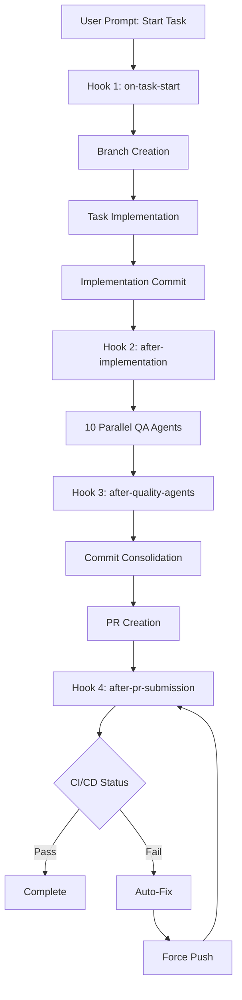
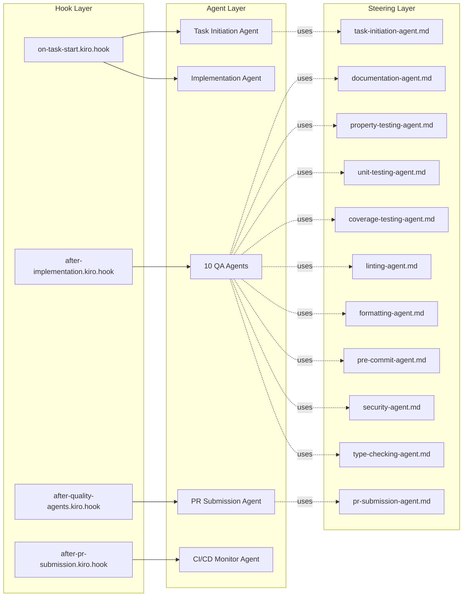

# Task Orchestration Workflow - Design Document

## Overview

The Task Orchestration Workflow is a hook-based automation system that manages the complete lifecycle of task execution in Kiro. The design leverages Kiro's native capabilities—hooks, steering files, and existing tools—to create a zero-custom-code solution that orchestrates branch creation, implementation, quality assurance, PR submission, and CI/CD monitoring.

The workflow is triggered by user prompts and operates through four sequential hooks, each responding to specific events (promptSubmit or agentStop). The second hook launches 10 quality assurance agents in parallel, maximizing efficiency while maintaining comprehensive validation.

## Architecture

### High-Level Architecture



### Hook Chain Architecture

The workflow uses a chain of hooks that trigger sequentially based on agent completion:

1. **promptSubmit Event** → Hook 1 (Task Initiation)
2. **agentStop Event** (after implementation) → Hook 2 (Quality Agents)
3. **agentStop Event** (after quality agents) → Hook 3 (PR Submission)
4. **agentStop Event** (after PR creation) → Hook 4 (CI/CD Monitoring)

Each hook is responsible for:
- Detecting if it should activate (context detection)
- Invoking the appropriate agent(s) with focused context
- Passing control to the next hook in the chain

### Component Architecture



## Components and Interfaces

### Hook 1: Task Initiation (on-task-start.kiro.hook)

**Purpose**: Detect task start requests, create topic branch, and initiate implementation.

**Trigger**: `promptSubmit` event

**Context Detection Logic**:
```
IF prompt contains phrases like:
  - "start task"
  - "begin task"
  - "implement task"
  - "work on task"
AND prompt references a task ID or task from tasks.md
THEN activate this hook
```

**Agent Invocation**:
```json
{
  "enabled": true,
  "name": "Task Initiation Hook",
  "description": "Detects task start requests, creates topic branch, and begins implementation",
  "version": "1",
  "when": {
    "type": "promptSubmit"
  },
  "then": {
    "type": "askAgent",
    "prompt": "You are the Task Initiation Agent. Follow the guidance in .kiro/steering/task-initiation-agent.md to:\n1. Parse the user's prompt to identify the task they want to start\n2. Use the taskStatus tool to mark the task as 'in_progress'\n3. Create a topic branch using: git checkout -b <type>/<task-id>-<description> origin/main\n4. Ensure the branch is up-to-date with origin/main\n5. Set upstream tracking to origin/main\n6. Implement the task according to its requirements and design\n7. Create ONE implementation commit following Conventional Commits format: <type>(<scope>): <task-id> <task-title>\n\nThe task details are in the user's prompt. Begin now."
  },
  "shortName": "on-task-start"
}
```

**Outputs**:
- Topic branch created and checked out
- Task marked as "in_progress" in tasks.md
- Implementation completed
- One implementation commit created

### Hook 2: Quality Assurance (after-implementation.kiro.hook)

**Purpose**: Launch 10 parallel quality assurance agents after implementation completes.

**Trigger**: `agentStop` event

**Context Detection Logic**:
```
IF most recent commit message matches:
  - Conventional Commits format (feat|fix|refactor|perf)
  - Contains task ID
AND no subsequent quality commits exist (docs|test|chore)
THEN activate this hook
```

**Agent Invocation**:
The hook launches 10 agents in parallel using `invokeSubAgent`:

1. **Documentation Agent**
   - Steering: `.kiro/steering/documentation-agent.md`
   - Task: Update inline comments, README, API docs
   - Commit: `docs(<scope>): update documentation for <context>`

2. **Property Testing Agent**
   - Steering: `.kiro/steering/property-testing-agent.md`
   - Task: Create property-based tests (100+ iterations)
   - Commit: `test(<scope>): add property-based tests for <context>`

3. **Unit Testing Agent**
   - Steering: `.kiro/steering/unit-testing-agent.md`
   - Task: Create unit tests for specific cases
   - Commit: `test(<scope>): add unit tests for <context>`

4. **Coverage Testing Agent**
   - Steering: `.kiro/steering/coverage-testing-agent.md`
   - Task: Verify 90%+ coverage (statements, branches, functions, lines)
   - Commit: `test(<scope>): improve test coverage to 90%+ for <context>`

5. **Linting Agent**
   - Steering: `.kiro/steering/linting-agent.md`
   - Task: Run ESLint/TSLint with auto-fix
   - Commit: `chore(<scope>): apply linting fixes for <context>`

6. **Formatting Agent**
   - Steering: `.kiro/steering/formatting-agent.md`
   - Task: Run Prettier with auto-fix
   - Commit: `chore(<scope>): apply formatting fixes for <context>`

7. **Pre-commit Validation Agent**
   - Steering: `.kiro/steering/pre-commit-agent.md`
   - Task: Run all pre-commit hooks
   - Commit: `chore(<scope>): apply pre-commit fixes for <context>`

8. **Security Audit Agent**
   - Steering: `.kiro/steering/security-agent.md`
   - Task: Check for vulnerabilities, secrets, injection risks
   - Commit: `chore(<scope>): apply security fixes for <context>`

9. **Type Checking Agent**
   - Steering: `.kiro/steering/type-checking-agent.md`
   - Task: Verify TypeScript compilation
   - Commit: `chore(<scope>): fix type errors for <context>`

10. **Build Verification Agent**
    - Steering: `.kiro/steering/build-verification-agent.md`
    - Task: Verify project builds successfully
    - Commit: `chore(<scope>): fix build errors for <context>`

**Parallel Execution**:
```json
{
  "enabled": true,
  "name": "Quality Assurance Hook",
  "description": "Launches 10 parallel quality assurance agents after implementation",
  "version": "1",
  "when": {
    "type": "agentStop"
  },
  "then": {
    "type": "askAgent",
    "prompt": "You are the Quality Orchestration Agent. The implementation is complete. Now launch 10 quality assurance agents in parallel using invokeSubAgent:\n\n1. Documentation Agent - Follow .kiro/steering/documentation-agent.md\n2. Property Testing Agent - Follow .kiro/steering/property-testing-agent.md\n3. Unit Testing Agent - Follow .kiro/steering/unit-testing-agent.md\n4. Coverage Testing Agent - Follow .kiro/steering/coverage-testing-agent.md\n5. Linting Agent - Follow .kiro/steering/linting-agent.md\n6. Formatting Agent - Follow .kiro/steering/formatting-agent.md\n7. Pre-commit Validation Agent - Follow .kiro/steering/pre-commit-agent.md\n8. Security Audit Agent - Follow .kiro/steering/security-agent.md\n9. Type Checking Agent - Follow .kiro/steering/type-checking-agent.md\n10. Build Verification Agent - Follow .kiro/steering/build-verification-agent.md\n\nEach agent should commit their changes independently. Wait for all agents to complete before finishing."
  },
  "shortName": "after-implementation"
}
```

**Outputs**:
- 10 quality commits (docs, test, chore types)
- All quality checks passing
- Code ready for PR submission

### Hook 3: PR Submission (after-quality-agents.kiro.hook)

**Purpose**: Consolidate commits into clean history and create pull request.

**Trigger**: `agentStop` event

**Context Detection Logic**:
```
IF recent commits include:
  - One implementation commit (feat|fix|refactor|perf)
  - Multiple quality commits (docs|test|chore)
AND no PR exists for current branch
THEN activate this hook
```

**Commit Consolidation Strategy**:

The hook performs a soft reset against `origin/main` to consolidate all commits:

```bash
# Soft reset preserves all changes in staging area
git reset --soft origin/main

# Re-commit with clean, logical structure
git commit -m "<type>(<scope>): <task-id> <task-title>"
git commit -m "test(<scope>): add comprehensive tests for <context>"
git commit -m "docs(<scope>): update documentation for <context>"
git commit -m "chore(<scope>): apply code quality fixes for <context>"
```

**Agent Invocation**:
```json
{
  "enabled": true,
  "name": "PR Submission Hook",
  "description": "Consolidates commits and creates pull request",
  "version": "1",
  "when": {
    "type": "agentStop"
  },
  "then": {
    "type": "askAgent",
    "prompt": "You are the PR Submission Agent. Follow the guidance in .kiro/steering/pr-submission-agent.md to:\n1. Validate all quality agents completed successfully\n2. Use taskStatus tool to mark task as 'completed'\n3. Perform soft reset: git reset --soft origin/main\n4. Re-commit all changes with clean, consolidated commits:\n   - Implementation: <type>(<scope>): <task-id> <task-title>\n   - Testing: test(<scope>): add comprehensive tests for <context>\n   - Documentation: docs(<scope>): update documentation for <context>\n   - Quality: chore(<scope>): apply code quality fixes for <context>\n5. Push branch: git push -u origin HEAD\n6. Create PR: gh pr create --title '<title>' --body '<body>'\n7. Add labels based on commit types\n\nBegin now."
  },
  "shortName": "after-quality-agents"
}
```

**Outputs**:
- Task marked as "completed" in tasks.md
- Clean commit history (4 commits maximum)
- Branch pushed to origin
- PR created with title, body, and labels

### Hook 4: CI/CD Monitoring (after-pr-submission.kiro.hook)

**Purpose**: Monitor CI/CD pipeline and automatically fix failures.

**Trigger**: `agentStop` event

**Context Detection Logic**:
```
IF recent git operations include:
  - git push to origin
  - gh pr create OR gh pr update
AND PR exists for current branch
THEN activate this hook
```

**Monitoring Strategy**:

```bash
# Watch CI/CD status
gh pr checks <pr-number> --watch

# If checks fail, retrieve logs
gh pr checks <pr-number> --json name,conclusion,detailsUrl

# Analyze failure and apply fixes
# Then soft reset and re-commit with clean history
git reset --soft origin/main
# Re-create clean commits
git push --force-with-lease
```

**Agent Invocation**:
```json
{
  "enabled": true,
  "name": "CI/CD Monitoring Hook",
  "description": "Monitors CI/CD pipeline and automatically fixes failures",
  "version": "1",
  "when": {
    "type": "agentStop"
  },
  "then": {
    "type": "askAgent",
    "prompt": "You are the CI/CD Monitor Agent. Monitor the PR's CI/CD pipeline:\n1. Use 'gh pr checks <pr-number> --watch' to monitor status\n2. If all checks pass, report success and exit\n3. If checks fail:\n   a. Retrieve failure logs: gh pr checks <pr-number> --json name,conclusion,detailsUrl\n   b. Analyze the failures\n   c. Pull latest from origin/main if needed\n   d. Fix the identified issues\n   e. Soft reset: git reset --soft origin/main\n   f. Re-commit with clean history (same structure as PR submission)\n   g. Force push: git push --force-with-lease\n   h. Repeat monitoring (max 3 attempts)\n4. If fixes fail after 3 attempts, report detailed error to user\n\nBegin monitoring now."
  },
  "shortName": "after-pr-submission"
}
```

**Outputs**:
- CI/CD checks passing
- Automatic fixes applied if needed
- Clean commit history maintained
- User notified of success or unrecoverable failures

## Data Models

### Hook Configuration Schema

```typescript
interface KiroHook {
  enabled: boolean;              // Whether the hook is active
  name: string;                  // Human-readable name
  description: string;           // What the hook does
  version: string;               // Hook version (e.g., "1")
  when: {
    type: 'promptSubmit' | 'agentStop' | 'fileEdited' | 'fileCreated' | 'fileDeleted' | 'userTriggered';
    patterns?: string[];         // For file events: array of glob patterns
  };
  then: {
    type: 'askAgent' | 'runCommand';
    prompt?: string;             // For askAgent: prompt to give the agent
    command?: string;            // For runCommand: shell command to execute
  };
  workspaceFolderName?: string;  // Optional workspace folder name
  shortName: string;             // Short identifier for the hook
}
```

### Steering File Schema

Steering files are Markdown documents with the following structure:

```markdown
# [Agent Name]

## Purpose
[What this agent does]

## Context
[What information the agent has access to]

## Instructions
[Step-by-step guidance for the agent]

## Commit Format
[Expected commit message format]

## Success Criteria
[How to know the agent succeeded]

## Error Handling
[What to do if things go wrong]
```

### Workflow State Model

While the workflow doesn't explicitly persist state (hooks are stateless), the Git repository itself serves as the state store:

```typescript
interface WorkflowState {
  // Derived from Git
  currentBranch: string;           // Current topic branch
  commits: Commit[];               // Commit history
  taskStatus: 'not_started' | 'in_progress' | 'completed';  // From tasks.md
  
  // Derived from GitHub
  prNumber?: number;               // PR number if created
  prUrl?: string;                  // PR URL
  ciStatus: 'pending' | 'success' | 'failure';  // CI/CD status
  
  // Derived from commit messages
  hasImplementation: boolean;      // Has feat/fix/refactor commit
  hasTests: boolean;               // Has test commits
  hasDocs: boolean;                // Has docs commits
  hasQuality: boolean;             // Has chore commits
}
```

### Task Reference Model

```typescript
interface TaskReference {
  taskId: string;                  // e.g., "1.2" or "3"
  taskTitle: string;               // e.g., "Implement user authentication"
  taskFile: string;                // Path to tasks.md
  requirementsFile?: string;       // Path to requirements.md
  designFile?: string;             // Path to design.md
}
```

### Commit Message Model

Following Conventional Commits specification:

```typescript
interface ConventionalCommit {
  type: 'feat' | 'fix' | 'docs' | 'test' | 'chore' | 'refactor' | 'perf' | 'style' | 'ci' | 'build';
  scope?: string;                  // Optional scope (e.g., "auth", "api")
  subject: string;                 // Short description
  body?: string;                   // Detailed description
  footer?: string;                 // Breaking changes, issue references
  
  // For implementation commits
  taskId?: string;                 // e.g., "1.2"
  
  // For quality commits
  context?: string;                // What was improved (e.g., "user authentication")
}
```

## Correctness Properties

*A property is a characteristic or behavior that should hold true across all valid executions of a system—essentially, a formal statement about what the system should do. Properties serve as the bridge between human-readable specifications and machine-verifiable correctness guarantees.*


### Property 1: Hook Activation on Events

*For any* workflow execution, when the appropriate event occurs (promptSubmit or agentStop), the corresponding hook should be triggered and execute its configured action.

**Validates: Requirements 1.1, 2.1, 3.1, 4.1**

### Property 2: Context Detection Accuracy

*For any* hook execution, the hook should correctly identify whether it should activate based on the current context (commit history, Git operations, or prompt content), and only proceed if its activation conditions are met.

**Validates: Requirements 1.2, 2.2, 3.2, 4.2**

### Property 3: Task Status Transitions

*For any* task in the workflow, the task status should transition from "not_started" → "in_progress" (when implementation begins) → "completed" (when PR is created), and each transition should be recorded in tasks.md via the taskStatus tool.

**Validates: Requirements 1.3, 3.4**

### Property 4: Branch Creation Hygiene

*For any* task that begins implementation, a topic branch should be created with the naming pattern `<type>/<task-id>-<description>`, based on the latest origin/main commit, with upstream tracking set to origin/main.

**Validates: Requirements 1.4, 1.5, 1.6**

### Property 5: Implementation Commit Format

*For any* completed implementation, exactly one commit should exist with a message following Conventional Commits format: `<type>(<scope>): <task-id> <task-title>`, where type is one of feat, fix, refactor, or perf.

**Validates: Requirements 1.8**

### Property 6: Parallel Quality Agent Execution

*For any* implementation completion, exactly 10 quality assurance agents should be launched simultaneously and execute in parallel, with each agent completing independently of the others.

**Validates: Requirements 2.3, NFR-2**

### Property 7: Quality Agent Commit Independence

*For any* quality agent execution, if the agent makes changes, it should create exactly one commit with the appropriate type (docs, test, or chore) and a descriptive message indicating what was improved.

**Validates: Requirements 2.4**

### Property 8: Quality Agent Synchronization

*For any* quality agent execution phase, the workflow should not proceed to PR submission until all 10 agents have completed their work (successfully or with errors reported).

**Validates: Requirements 2.6**

### Property 9: Quality Completion Detection

*For any* commit history, the workflow should correctly identify when all quality agents have completed by detecting the presence of docs, test, and chore commits following an implementation commit.

**Validates: Requirements 3.3**

### Property 10: Soft Reset Preservation

*For any* topic branch with multiple commits, performing `git reset --soft origin/main` should preserve all file changes in the staging area while removing all commits from the branch history.

**Validates: Requirements 3.5, 4.6.3, NFR-8**

### Property 11: Commit Consolidation Structure

*For any* topic branch after quality agents complete, the consolidated commit history should contain exactly 4 commits in order: (1) implementation commit with task ID, (2) test commit, (3) docs commit, (4) chore commit, each following Conventional Commits format.

**Validates: Requirements 3.6, 3.6.1, 3.6.2, 3.6.3, 3.6.4, 4.6.4**

### Property 12: PR Creation with Metadata

*For any* consolidated topic branch, a pull request should be created with a title derived from the implementation commit, a body containing task details and changes summary, and labels corresponding to the commit types present.

**Validates: Requirements 3.8, 3.9**

### Property 13: CI/CD Monitoring Loop

*For any* created pull request, the CI/CD monitor should poll the check status at regular intervals, and continue monitoring until either all checks pass or the maximum retry limit (3 attempts) is reached.

**Validates: Requirements 4.3, 4.7**

### Property 14: CI/CD Fix and Retry

*For any* pull request with failing CI/CD checks, if fixes are applied, the workflow should perform a soft reset, re-create the consolidated commit structure, force push with lease, and restart monitoring.

**Validates: Requirements 4.6.1, 4.6.3, 4.6.4, 4.6.5**

### Property 15: CI/CD Timeout

*For any* CI/CD monitoring session, if 30 minutes elapse without all checks completing, the monitoring should timeout and report the current status to the user.

**Validates: Requirements NFR-4**

### Property 16: Quality Agent Fault Isolation

*For any* quality agent execution phase, if one or more agents fail, the remaining agents should continue executing and complete their work independently.

**Validates: Requirements NFR-5**

### Property 17: Workflow Idempotence

*For any* workflow execution, running the workflow twice with the same task and initial state should produce the same final result (same commits, same PR, same branch state).

**Validates: Requirements NFR-6**

### Property 18: Workflow Resumability

*For any* workflow execution that is interrupted at any step, the workflow should be able to resume from that step without re-executing completed steps or corrupting the repository state.

**Validates: Requirements NFR-7**

### Property 19: Configuration File Validity

*For all* hook configuration files (*.kiro.hook), the JSON should be valid and conform to the KiroHook schema, and for all steering files (*.md), the Markdown should be valid and well-formed.

**Validates: Requirements NFR-11**

### Property 20: Workflow Customizability

*For any* hook or steering file modification, the workflow behavior should change according to the modified configuration without requiring code changes or recompilation.

**Validates: Requirements NFR-10**

## Error Handling

### Hook-Level Error Handling

Each hook should implement error handling through its agent prompt:

1. **Validation Errors**: If preconditions aren't met (e.g., branch already exists, task not found), the agent should report the error clearly and halt execution.

2. **Tool Errors**: If a tool invocation fails (e.g., git command fails, gh cli fails), the agent should capture the error output, report it to the user, and halt execution.

3. **Timeout Errors**: If an operation takes too long (e.g., CI/CD monitoring exceeds 30 minutes), the agent should timeout gracefully and report the current state.

### Quality Agent Error Handling

Quality agents should handle errors independently:

1. **Non-Critical Failures**: If a quality check fails but can be skipped (e.g., optional documentation), the agent should log a warning and continue.

2. **Critical Failures**: If a quality check fails and cannot be skipped (e.g., build failure, test failure), the agent should report the error and mark itself as failed.

3. **Partial Success**: If some quality checks pass and others fail, the agent should commit the successful changes and report which checks failed.

### CI/CD Monitor Error Handling

The CI/CD monitor implements a retry strategy:

1. **Fixable Failures**: If a CI/CD check fails with a fixable error (e.g., lint error, test failure), attempt to fix and retry (max 3 attempts).

2. **Unfixable Failures**: If a CI/CD check fails with an unfixable error (e.g., external service down, infrastructure issue), report to user with detailed logs.

3. **Retry Exhaustion**: If 3 fix attempts are made and checks still fail, report to user with all failure logs and attempted fixes.

### Error Recovery Strategies

1. **Branch Cleanup**: If workflow fails during branch creation, delete the topic branch to allow retry.

2. **Commit Rollback**: If workflow fails during commit consolidation, reset to the pre-consolidation state.

3. **PR Cleanup**: If workflow fails during PR creation, the branch remains pushed but no PR is created, allowing manual PR creation or retry.

4. **State Preservation**: All errors should preserve the repository state in a consistent, recoverable condition.

## Testing Strategy

### Dual Testing Approach

The Task Orchestration Workflow requires both unit tests and property-based tests:

- **Unit tests**: Verify specific examples, edge cases, and error conditions for individual components
- **Property tests**: Verify universal properties across all workflow executions

### Property-Based Testing

Property-based tests should be implemented using a PBT library appropriate for the testing environment (e.g., fast-check for TypeScript/JavaScript, Hypothesis for Python).

**Configuration**:
- Minimum 100 iterations per property test
- Each test should reference its design document property
- Tag format: **Feature: task-orchestration-workflow, Property {number}: {property_text}**

**Property Test Coverage**:

1. **Hook Activation Tests** (Property 1, 2)
   - Generate random events and contexts
   - Verify hooks activate only when conditions are met
   - Test with various commit histories and prompt patterns

2. **Task Status Tests** (Property 3)
   - Generate random task workflows
   - Verify status transitions occur correctly
   - Test with interrupted workflows

3. **Branch Creation Tests** (Property 4, 5)
   - Generate random task identifiers
   - Verify branch naming and setup
   - Verify commit format compliance

4. **Parallel Execution Tests** (Property 6, 7, 8)
   - Generate random quality agent scenarios
   - Verify parallelism and independence
   - Test with various agent completion orders

5. **Commit Consolidation Tests** (Property 10, 11)
   - Generate random commit histories
   - Verify soft reset preserves changes
   - Verify consolidated structure is correct

6. **PR Creation Tests** (Property 12)
   - Generate random task contexts
   - Verify PR metadata is correct
   - Test with various commit type combinations

7. **CI/CD Monitoring Tests** (Property 13, 14, 15)
   - Generate random CI/CD check results
   - Verify monitoring loop behavior
   - Test retry logic and timeout

8. **Fault Tolerance Tests** (Property 16, 17, 18)
   - Generate random failure scenarios
   - Verify fault isolation
   - Test idempotence and resumability

9. **Configuration Tests** (Property 19, 20)
   - Generate random configuration modifications
   - Verify JSON/Markdown validity
   - Test customization behavior

### Unit Testing

Unit tests should focus on:

1. **Hook Configuration Validation**
   - Test each hook file is valid JSON
   - Test each hook has required fields
   - Test hook prompts are well-formed

2. **Steering File Validation**
   - Test each steering file is valid Markdown
   - Test each steering file has required sections
   - Test steering instructions are clear

3. **Context Detection Logic**
   - Test specific prompt patterns (e.g., "start task 1.2")
   - Test specific commit patterns (e.g., "feat(auth): 1.2 Add login")
   - Test edge cases (e.g., malformed prompts, missing commits)

4. **Commit Message Parsing**
   - Test Conventional Commits parsing
   - Test task ID extraction
   - Test commit type detection

5. **Error Scenarios**
   - Test branch already exists
   - Test task not found
   - Test git command failures
   - Test gh cli failures
   - Test CI/CD timeout

6. **Integration Points**
   - Test taskStatus tool integration
   - Test invokeSubAgent integration
   - Test git command integration
   - Test gh cli integration

### Test Organization

```
tests/
├── unit/
│   ├── hooks/
│   │   ├── on-task-start.test.ts
│   │   ├── after-implementation.test.ts
│   │   ├── after-quality-agents.test.ts
│   │   └── after-pr-submission.test.ts
│   ├── steering/
│   │   ├── validation.test.ts
│   │   └── format.test.ts
│   └── utils/
│       ├── commit-parser.test.ts
│       ├── context-detector.test.ts
│       └── branch-namer.test.ts
└── property/
    ├── hook-activation.property.test.ts
    ├── task-status.property.test.ts
    ├── branch-creation.property.test.ts
    ├── parallel-execution.property.test.ts
    ├── commit-consolidation.property.test.ts
    ├── pr-creation.property.test.ts
    ├── ci-monitoring.property.test.ts
    ├── fault-tolerance.property.test.ts
    └── configuration.property.test.ts
```

### Testing Constraints

Since this workflow uses zero custom code (only JSON hooks and Markdown steering files), testing focuses on:

1. **Configuration Validation**: Ensuring all configuration files are valid and well-formed
2. **Integration Testing**: Ensuring hooks integrate correctly with Kiro's native tools
3. **Behavior Verification**: Ensuring the workflow behaves as specified through end-to-end tests
4. **Property Verification**: Ensuring universal properties hold across all workflow executions

The testing strategy should not require implementing the workflow logic itself, but rather validating that the configuration files correctly specify the desired behavior.

## Implementation Notes

### Hook Development Guidelines

1. **Keep Prompts Focused**: Each hook prompt should be clear, concise, and focused on a single responsibility.

2. **Reference Steering Files**: Hook prompts should reference steering files for detailed instructions rather than embedding all logic in the prompt.

3. **Use Explicit Tool Names**: Always use exact tool names (taskStatus, invokeSubAgent, etc.) in prompts.

4. **Include Error Handling**: Prompts should include instructions for error scenarios.

5. **Maintain Context Boundaries**: Each hook should only access the context it needs, not the entire repository.

### Steering File Development Guidelines

1. **Follow Template Structure**: All steering files should follow the standard template (Purpose, Context, Instructions, Commit Format, Success Criteria, Error Handling).

2. **Be Specific**: Instructions should be specific and actionable, not vague or general.

3. **Include Examples**: Provide examples of expected outputs (commit messages, file changes, etc.).

4. **Document Tools**: Clearly document which Kiro tools the agent should use.

5. **Define Success**: Clearly define what success looks like for the agent's task.

### Git Operation Guidelines

1. **Always Use Soft Reset**: When consolidating commits, always use `git reset --soft` to preserve changes.

2. **Use Force-with-Lease**: When force pushing, always use `--force-with-lease` to prevent overwriting others' work.

3. **Verify Branch State**: Before operations, verify the branch is in the expected state.

4. **Atomic Operations**: Keep Git operations atomic and reversible.

### Parallel Execution Guidelines

1. **Maximum 10 Agents**: Kiro supports maximum 10 parallel sub-agents, so quality agents are limited to 10.

2. **Independent Agents**: Each quality agent should be completely independent and not depend on others' results.

3. **Separate Commits**: Each agent should commit its changes independently to avoid conflicts.

4. **Failure Isolation**: Agent failures should not affect other agents' execution.

### Commit Message Guidelines

1. **Follow Conventional Commits**: All commits must follow the Conventional Commits specification.

2. **Include Task ID**: Implementation commits must include the task ID in the subject.

3. **Be Descriptive**: Commit messages should clearly describe what changed and why.

4. **Use Consistent Scopes**: Use consistent scope names across commits (e.g., "auth", "api", "ui").

### PR Creation Guidelines

1. **Descriptive Titles**: PR titles should be derived from the implementation commit subject.

2. **Detailed Bodies**: PR bodies should include:
   - Task reference
   - Summary of changes
   - Testing performed
   - Related issues/PRs

3. **Appropriate Labels**: Labels should be added based on commit types:
   - feat → "enhancement"
   - fix → "bug"
   - docs → "documentation"
   - test → "testing"
   - chore → "maintenance"

4. **Link Issues**: If the task references an issue, link it in the PR body.

## Future Enhancements

### Potential Improvements

1. **Configurable Quality Agents**: Allow users to configure which quality agents run and in what order.

2. **Custom Quality Agents**: Support user-defined quality agents beyond the default 10.

3. **Conditional Execution**: Support conditional hook execution based on file patterns or task types.

4. **Workflow Templates**: Provide templates for common workflow patterns (feature, bugfix, refactor, etc.).

5. **Metrics Collection**: Collect and report metrics on workflow execution time, success rate, etc.

6. **Notification Integration**: Integrate with notification systems (Slack, email) for workflow status updates.

7. **Multi-PR Support**: Support workflows that create multiple PRs for large tasks.

8. **Dependency Management**: Support workflows with dependencies between tasks.

### Scalability Considerations

1. **Large Repositories**: For large repositories, consider limiting the scope of quality agents to changed files only.

2. **Long-Running Tasks**: For tasks that take hours or days, consider checkpoint mechanisms to save progress.

3. **Multiple Workflows**: Support running multiple workflows in parallel for different tasks.

4. **Resource Limits**: Monitor and enforce resource limits (CPU, memory, API rate limits) for agent execution.

## Appendix: Example Configurations

### Example Hook 1: on-task-start.kiro.hook

```json
{
  "enabled": true,
  "name": "Task Initiation Hook",
  "description": "Detects task start requests, creates topic branch, and begins implementation",
  "version": "1",
  "when": {
    "type": "promptSubmit"
  },
  "then": {
    "type": "askAgent",
    "prompt": "You are the Task Initiation Agent. Follow the guidance in .kiro/steering/task-initiation-agent.md to:\n1. Parse the user's prompt to identify the task they want to start\n2. Use the taskStatus tool to mark the task as 'in_progress'\n3. Create a topic branch using: git checkout -b <type>/<task-id>-<description> origin/main\n4. Ensure the branch is up-to-date with origin/main\n5. Set upstream tracking to origin/main\n6. Implement the task according to its requirements and design\n7. Create ONE implementation commit following Conventional Commits format: <type>(<scope>): <task-id> <task-title>\n\nThe task details are in the user's prompt. Begin now."
  },
  "shortName": "on-task-start"
}
```

### Example Steering File: task-initiation-agent.md

```markdown
# Task Initiation Agent

## Purpose

Detect task start requests from user prompts, set up the proper Git branch, and implement the task according to its requirements and design.

## Context

You have access to:
- User's prompt (contains task reference)
- tasks.md file (contains task list)
- requirements.md and design.md (if they exist for this task)
- All Kiro tools (taskStatus, git, file operations)

## Instructions

### Step 1: Parse Task Reference

Look for patterns in the user's prompt:
- "start task X" or "begin task X"
- "implement task X" or "work on task X"
- "do task X" or "execute task X"

Extract the task ID (e.g., "1.2", "3", "2.1").

### Step 2: Mark Task as In Progress

Use the taskStatus tool:
```
taskStatus(
  taskFilePath: ".kiro/specs/<spec-name>/tasks.md",
  task: "<task-id> <task-title>",
  status: "in_progress"
)
```

### Step 3: Create Topic Branch

Determine the branch type based on task:
- "feat" for new features
- "fix" for bug fixes
- "refactor" for code refactoring
- "perf" for performance improvements

Create the branch:
```bash
git checkout -b <type>/<task-id>-<description> origin/main
git branch --set-upstream-to=origin/main
```

### Step 4: Implement the Task

Read the task description, requirements, and design. Implement the task according to the specifications.

### Step 5: Create Implementation Commit

After implementation, create ONE commit:
```bash
git add .
git commit -m "<type>(<scope>): <task-id> <task-title>"
```

Example: `git commit -m "feat(auth): 1.2 Implement user login"`

## Commit Format

```
<type>(<scope>): <task-id> <task-title>

<optional body with more details>

<optional footer with issue references>
```

## Success Criteria

- Task status is "in_progress" in tasks.md
- Topic branch exists and is based on origin/main
- Upstream tracking is set to origin/main
- Implementation is complete
- Exactly ONE commit exists with proper format

## Error Handling

- If task ID not found: Report error and ask user to clarify
- If branch already exists: Report error and ask user to delete or choose different name
- If git operations fail: Report error with git output
- If implementation unclear: Ask user for clarification
```

### Example Hook 2: after-implementation.kiro.hook

```json
{
  "enabled": true,
  "name": "Quality Assurance Hook",
  "description": "Launches 10 parallel quality assurance agents after implementation",
  "version": "1",
  "when": {
    "type": "agentStop"
  },
  "then": {
    "type": "askAgent",
    "prompt": "You are the Quality Orchestration Agent. The implementation is complete. Now launch 10 quality assurance agents in parallel using invokeSubAgent:\n\n1. Documentation Agent - Follow .kiro/steering/documentation-agent.md\n2. Property Testing Agent - Follow .kiro/steering/property-testing-agent.md\n3. Unit Testing Agent - Follow .kiro/steering/unit-testing-agent.md\n4. Coverage Testing Agent - Follow .kiro/steering/coverage-testing-agent.md\n5. Linting Agent - Follow .kiro/steering/linting-agent.md\n6. Formatting Agent - Follow .kiro/steering/formatting-agent.md\n7. Pre-commit Validation Agent - Follow .kiro/steering/pre-commit-agent.md\n8. Security Audit Agent - Follow .kiro/steering/security-agent.md\n9. Type Checking Agent - Follow .kiro/steering/type-checking-agent.md\n10. Build Verification Agent - Follow .kiro/steering/build-verification-agent.md\n\nEach agent should commit their changes independently. Wait for all agents to complete before finishing."
  },
  "shortName": "after-implementation"
}
```
